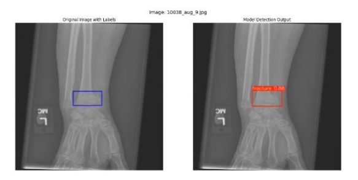
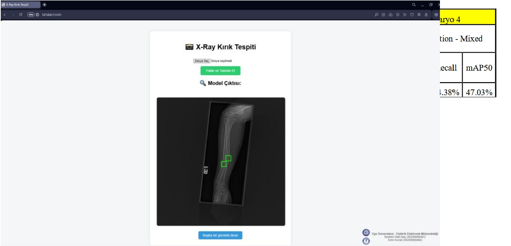

# Detection of Fractures on X-Ray Bone Images with Deep Learning Methods

This project focuses on the **detection and localization of fractures in X-Ray bone images** using deep learning-based object detection models. Four state-of-the-art architectures were evaluated: **YOLOv8, RT-DETR, Faster R-CNN, and RetinaNet**. Among these, **RT-DETR-X** achieved the best performance with **mAP@50 = 72.9%**.

---

## 📊 Dataset
The dataset used in this study was compiled from open-access sources and is available on Kaggle:  
👉 [Fracture Detection Dataset](https://www.kaggle.com/datasets/emirkiv/fracture-detection-ekiha-final)

---

## 🧠 Models Used
- **YOLOv8** (Ultralytics)  
- **RT-DETR** (Ultralytics, Transformer-based)  
- **Faster R-CNN** (Detectron2)  
- **RetinaNet** (Torchvision)  

---

## 📌 Results

### 🔹 Model Performance Metrics
  
  
  
  

### 🔹 Sample Outputs
Fracture detection example:  
  

Interface example:  
  

---

## 🖥️ Interface
A lightweight **Flask-based desktop application** was developed.  
Users can upload an X-Ray image, and the model automatically highlights the detected fracture areas with bounding boxes.  

---

## ✨ Contributors
- **İbrahim Halil Atay**  
- **Emir Kıvrak**  
Advisor: **Assoc. Prof. Dr. Erkan Zeki Engin (Ege University)**  
